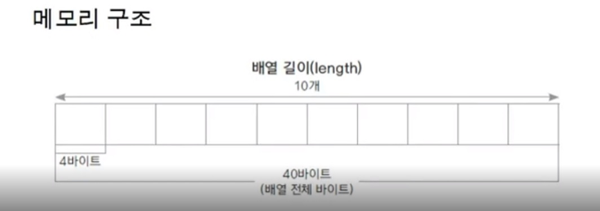

# Doit java - 클래스와 객체(1)

객체(object) - 구체적, 추상적 데이터 단위

객체지향 프로그래밍(object Oriented Programming / OOP) - 객체(object)를 기반으로 하는 프로그래밍

**객체지향 프로그래밍 예시)**

▼시간의 흐름에 따른 프로그래밍 == 순차적 프로그래밍▼

아침에 일어난다. →  밥을 먹는다. →  씻는다. →옷을 갈아 입는다. →  버스를 탄다. → 요금을 지불한다. →학교도착

▼객체지향프로그래밍 (대상을 위주로 생각해야함)▼

학생  (시험을 본다, 공부를 한다.),버스 (학생을 데려다 주는  기능) 등등…

**객체간의 협력이 일어나는 것. 시간의 순서에 따른 것이 아닌 객체를 정의하여 객체들이 제공하는 기능을 사용하는 것.

class

class - 객체(object)를 코드로 정의한 것.

멤버변수 - 객체(object)의  속성, 특성 등을 정의한 것.

메서드 - 객체(object)의 기능.

class 정의 하기.

(접근제어자)  calss 클래스 이름 {

멤버변수;

메서드;

}

class 예시)

student class

속성 : 학번, 이름, 학년

기능 : 수강신청, 수업듣기

Package - 소스의 묶음,  class를 [구별해줌,  local directory](http://구별해줌.directory) 별로 정리가 된다.

----------------------------------------------------------------------------------------------------------
# Doit java - 클래스와 객체1(2)

**메서드** -  함수의 일종. class안에 멤버변수로 구현된 함수의 일부.

**함수** - 하나의 기능을 수행하는 일련의 코드. 중복되는 기능을 함수로 구현. 

**ex) 함수의 예시**

숫자를 더한다. 가장 좋은 성적 두개를 더한다.  두 거리를 더한다.

더하기 함수 를 만들어서 공통적으로 사용 하는 것.

함수

입력값 ==  매개변수

결과값 == 반환값

int add (int num1, int num2){               add →함수 이름 : 함수의 기능과 관련하여 명명

     int result;                             int num1, int num2 → 매개변수 : 함수의 수행을 위해 필요한 변수

     result = num1 + num2;             return→예약어 : 함수의 수행결과흫 반환하기 위한 예약어

     return result;                             int → 함수 반환형 : 반환 값의 자료현을 나타냄.

                                                                                 반환값이 없는 경우 void 라고 씀

}

**함수 구현하고 스택메모리**

**스택(stack)** : 함수가 호출될때 사용하는 메모리

                      지역변수가 자리를 잡는 것

main() - >addNum() 함수 호출

**함수가 호출되어 지역변수가 불러진다. →함수가 마무리되면서  스택의 메모리가 사라진다.**

함수를 사용하는 이유? 

필요한 기능별로 나눠 정의 하여, 각 기능별로 호출하여 사용한다.

함수는 하나의 기능을 함수 이름에 맞게 구현 하는 것이 가장 적절하다.

----------------------------------------------------------------------------------------------------------------------
# Doit java -클래스와 객체1(3)

클래스 & 인스턴스

클래스                   ————>                 인스턴스

(staic코드)     생성(인스턴스화)     (dynamic memory)

   개                  시츄,달마시안 …               메모리에 올라간 객체

**클래스 생성하기**

클래스를 사용하기 위해 클래스를 생성해야함

new 예약어를 이용하여  클래스 생성!!

**인스턴스 생성하기**

Student    studentLee   =   new Student(); //생성자는 힙메모리에 생성됨.

클래스형    변수이름      new   생성자()

 studentLee.showStudentInfo();

**인스턴스와 힙메모리**

하나의 클래스 코드로 부터 여러개의 인스턴스를 생성

인스턴스는 힙 메모리에 생성됨.

각가의 인스턴스는 다른 메모리에 다른 값을 가짐

**힙 메모리** -동적으로 생성되는 메모리.

Student 의 객체 studentId, studentName, grade, address가 힙 메모리에 잡힌다.

인스턴스(studentId, studentName, grade, address)의 주소값은 stack메모리( studentLee)에 저장된다.

Stack 메모리에 저장된 인스턴스 주소값을 호출하면 아래와 같다.

ClassPart.Student@16f65612

패키지명.클래스명@비트수

**생성자(constructor) :**

class 이름과 동일

반환 타입이 ㅇ벗음

new 키워드로 인해서만 생성된다.

하나의 생성자라도 있으면 default 생성자는 생기지 않는다.

생성자는 메소드가 아니며, 상속되지 않는다.

**기본생성자 (default constructor)** :  

public Student(){ }

default 생성자는 자바 compiler가 자동으로 생성해준다.

생성자가 하나도 없을 떄 생긴다.  

===============================================
# Doit java -클래스와 객체1(4)  

**참조자료형(reference type)**  

변수의 자료형  

1.기본자료형 : int, long, float,등  

2.참조자료형 : String, Date, Student 등

기존 자바 라이브러리 jdk에서 제공하는 자료형등, class들

혹은 사용자가 직접 만들어서 사용하는 것(class)

 

정보은닉

private 접근제어자

클래스의 외부에서 클래스 내부의 멤버변수나 메서드에 접근하지 못하게 하는 경우 사용.

하나의 파일안에는 클래스가 여러개일 수 있다.
======================================================
# Doit java -클래스와 객체2(1)  

this -자신의 메모리를 가리킴, 생성자에서 다른 생성자를 호출, 자신의 주소를 반환함  
 
 ex)   

class BirthDay{  
   int day;  
   int month;  
   int year;  
}  

public void setYear(int year){  
   this.year = year  
   멤버변수year   매개변수 year 를 가리킴  

}  
public void printThis(){  
   System.out.println(this);  
}  

public class ThisExample{  
    public static void main(Stirng[] args){  
    BirthDay b1 =  new BirthDay();  
    BirthDay b2 =  new BirthDay();  

     System.out.println(b1);  
     b1.printThis();  

     //출력물  
     //thisex.Birthday@311d617d  
     //thisex.Birthday@311d617d  

     System.out.println(b2);  
     b2.printThis();  

     //출력물  
     //thisex.Birthday@7c53a9eb  
     //thisex.Birthday@7c53a9eb  

 }
}

###생성자에서 다른 생성자를 호출하는 this  
 class person{  
   String name;  
   int age;  

   public Person(){  
      this("이름없음", 1);  
      // 아래에 만든 생성자를 불러 사용하는 것.   
   }
   public person(Stirn name, int age){  
      this.name = name;  
      this.age = age;  
   }
   
   public Person returnSelf(){  
      retuen this;  
   }
}  
public class ThisExCallAnotherConat{  
    public static void main(Stirng[] args){  
    
    Person p1 =  new Person();  
    System.out.println(p1.name);  
      //출력물  
     //이름없음  
   System.out.println(p1.returnSelf);  

     //출력물  
     //thisex.Person@16d65612  

 
 }
}
----------------------------------------------------------------------
# Doit java -클래스와 객체2(2)

객체간의 협력  

메서드   
승차  
정보  

학생  
-학생이름  
-돈  
-학년  

public class Student {
	
	String studentName;
	int money;
	
	public Student(String studentName,int money) {
		this.studentName = studentName;
		this.money = money;
	}
	
	public void takeBus(Bus bus) {
		bus.take(1000);
		this.money -= 1000;
	}
	
	public void takeSubway(Subway subway) {
		subway.take(1200);
		this.money -= 1200;
	}
	
	public void takeTaxi(Taxi taxi) {
		taxi.take(10000);
		this.money -= 10000;
	}
	
	public void showInfo() {
		System.out.println(studentName + "님의 남은 돈은 " + money + "원 입니다.");
	}

}

버스  
-번스번호  
-승객 수  
-돈  

public class Bus {
	
	int busNumber;
	int passengerCount;
	int money;
	
	public Bus(int busNumber) {
		this.busNumber = busNumber;
	}
	
	public void take(int money) {
		this.money += money;
		passengerCount++;
		
	}
	
	public void showBusInfo() {
		System.out.println(busNumber + "번의 승객수는 " + passengerCount + "명 이고, 수입은 " +  money + "원 입니다." );
	}
}

지하철
-지하철 노선번호
-승객 수
-돈

public class Subway {
	
	int lineNumber;
	int passengerCount;
	int money;
	
	public Subway(int lineNumber) {
		this.lineNumber = lineNumber;
	}
	
	public void take(int money) {
		this.money += money;
		passengerCount++;
		
	}
	
	public void showSubwayInfo() {
		System.out.println(lineNumber + "번의 승객수는 " + passengerCount + "명 이고, 수입은 " +  money + "원 입니다." );
	}
}

public class takeTransTest {

	public   void main(String[] args) {
		
		Student  studentJ = new Student("james", 5000);
		Student  studentT = new Student("Tomas", 10000);
		
		Bus bus100 = new Bus(100);
		Bus bus500 = new Bus(500);	
		studentJ.takeBus(bus100);
		
		Subway greenSubway = new Subway(2);
		studentT.takeSubway(greenSubway);
		

		studentJ.showInfo();
		studentT.showInfo();
		
		
		bus100.showBusInfo();
		greenSubway.showSubwayInfo();
	
		
	
	}

}
--------------------------------------------------------------------
# Doit java -클래스와 객체2(3)

static 변수  

static int seralNum  
sttic  자료형  변수이름  
sttic  --> 여러개의 인스턴스가 같은 메모리의 값을 공유하기 위해 사용  

student -> new 예약어로  힙메모리에 인스턴스 생성  
Static-> 공유되는 메모리는 따로 사용한다.   
         즉,전체프로그램이 메모리에 load 될때 할당받는다.  
         상수, 리터럴, static 변수등이 이 메모리를 사용한다.  

static 변수는 클래스변수라고도 함.  

ex)  
기준되는 숫자에 +를하여 각 학번을 부여할 수 있다. == static 변수로 사용  
A학생 10001학번  

B학생 10002학번  

public class Student{
   static inr serialNum = 10000;
   int StudetnId;
   String studentName;

   public Student(){
      serialNum ++;
      StudetnId = serialNum;
   }
}

public class StudentTest1 {

	public  static void main(String[] args) {
		
		Student  studentJ = new Student();
      System.out.println(studentJ.studentId);

		Student  studentT = new Student();
      System.out.println(studentJ.studentId);
	
      //c출력값
      //10001
      //10002
	
	}

}

### 지역변수
함수 내부에 선언하며 함수 내부에서만 사용한다.   
스택 메모리에 형성되며, 함수가 호출될떄 생성되고 함수가 끝나면 소멸한다.  

### 멤버변수(인스턴스 변수)  
클래스 멤버변수로 선언한다.  
클래스 내부에서만 사용하고 private이 아니면 참조변수로 다른 클래스에서 사용 가능하다.  
힙 메모리에 형성되며, 인스턴스가 생서될때 힙에 생성되고, 가비지 컬럭터가 메모리를 수거할때 소멸한다.  

### static 변수 (클래스변수)
static 예약어를 사용하여 클래스 내부에 선언한다.  
클래스 내부에서만 사용하고 private이 아니면 클래스 이름으로 다른 클래스에서 사용 가능하낟.  
데이터 영역 메모리에 형성된다.  
프로그램이 처음 시작할때 상수와 함께 데이터 영역에 생성되고 프로그램이 끝나고 메모리를 해제할 때 소멸된다.   

------------------------------------------------------
#  Doit java -클래스와 객체2(4)

static 응용 : singleton 패턴  
전 시스템에 단 하나의 인스턴스만이 존재하도록 구현하는 방식  

public class Companey{  
   private static Company instance = new company(); // 인스턴스는 단 1개로 생성이 되었고, 이 내부에서만 사용할 수 있다  

   private Company(){} // 외부에서 다른 생서자를 함부로 생성 할 수 없게끔 private  기본 생성자를 지정  

   public static Company geyInstance(){ //외부에서 가져다 쓸 수 있도록 해쥼
      return instance;  
   }
}

public class CompaneyTest{

   public Static void main(Stirng[] args){
      Company c1 = Company.geyInstance();

      Company c2 = Company.geyInstance();
      
      System.out.println(c1);
     //출력물
     //singleton.Company@311d617d
     System.out.println(c2);
     //출력물
     //singleton.Company@311d617d

     
   }
}
------------------------------------------------------------------
# 배열과 ArrayList(1)

배열 : 동일한 자료가 연속, 순치적으로 있는 자료구조  
여러개의 데이터가 동일한 자료형  

0 1 2 3 4==>배열 사이즈 : 20 byte, 배열 길이 : 5  
a b c d e  
배열은 고정길이로 선언해야한다.  
중간에 자료를 생략(공백)할 수 없다.  
fix된 배열에 새로운 내용을 추가할 시 새로운 배열을 만들어 기존것을 복사하고,   새로운 내역도 추가한다.  
 
### 배열 선언하기
방법1)  
자료형[] 배열이름 = new 자료형[개수]  
int[] arr = new int[10]  

방법2)  
자료형 배열이름[] = new 자료형[개수]  
int arr[] = new int[10]  

//배열 초기화  
방법1)  
int[] numbers = new int[] {0,1,2};  

방법2)  
int[] numbers = {0,1,2};  

방법3)  
int[] numbers = new int[3];  
오류)  
int[] numbers = new int[3] {0,1,2}; --> 배열개수를 지정하면 안됨  

### 배열사용하기
[] 인덱스 혹은 첨자연산자  
배열의 위치를 지정하여 자료를 가져옴    
모든 배열의 순서는 0부터 시작함  
n개의 배열은 0부터  n-1위치까지 자료가 존재  

### 배열의 길이와 유효한 요소값
배열길이 속성 : length  
자료가 있는 요소만 출력하려면 크기에 대한 저장을 따로 해야함  

ex)
		double[] num = new double[] {1,2,3};

		int size = 0;
		num[0] = 10.0; size++;
		num[1] = 20.0; size++;
		num[2] = 30.0; size++;
		
		double total = 1;
		for(int i =0; i<size; i++) {
			System.out.println(num[i]);
			total *= num[i];
		}
		System.out.println("total = " + total);
//출력값  
10.0  
20.0  
30.0  
total = 6000.0  

------------------------------------------------------------------
# 객체배열 사용하기(2)

### 객체배열 만들기  
참조 자료형을 선언하는 객체 배열  
배열만 새성한 경우 요소는 null로 초기화됨  
각 요소(객체)를 new 를 활용하여 생성하여 저장해야 함  

ex)
	public static void main(String[] args) {
		
		Book[] library = new Book[5];
		
		for(int i =0; i<library.length; i++) {
			System.out.println(library[i]);
		}
		
		
		library [0] = new Book("태백산맥1", "조정래");
		library [1] = new Book("태백산맥2", "조정래");
		library [2] = new Book("태백산맥3", "조정래");
		library [3] = new Book("태백산맥4", "조정래");
		library [4] = new Book("태백산맥5", "조정래");
		
		for(int i =0; i<library.length; i++) {
			System.out.println(library[i]);
		}
		
		for(int i =0; i<library.length; i++) {
			library[i].showBookInfo();
		}
		
 	}

//출력물
null  
null  
null  
null  
null  
array.Book@3e57cd70  
array.Book@9a7504c  
array.Book@2c039ac6  
array.Book@587d1d39  
array.Book@58c1670b  
태백산맥1, 조정래  
태백산맥2, 조정래  
태백산맥3, 조정래  
태백산맥4, 조정래  
태백산맥5, 조정래  

### 배열 복사하기
기존 배열과 같은 배열을 만들거나 배열이 꽉 찬 경우 더 큰배열을 만들고,  
기존 배열 자료를 복사할 수 있다.  

### 자바에서 제공하는 메서드    
 System.arraycopy(src, srcPos, dest, destPos, length);
-src : 복사할 배열 이름  
-srcPos : 복사할 배열의 첫번째 위치  
-dest : 복사해서 붙여 넣을 대상 배열 이름  
-destPos : 복사해서 대상 배열에 붙여넣기를 시작할 첫번째 위치  
-length : src에서 dest로 자료를 복사할 요소 개수  

### 객체 배열 복사하기
얕은 복사 : 배열 요소의 주소만 복사되므로 배열 요소가 변경되면 복사된 배열의 값도 변경됨
즉, 값이 복사가 된게 아니라 주소가 복사가 된것임.

ex)
public static void main(String[] args) {
		Book[] bookArray1 = new Book[3];
		Book[] bookArray2 = new Book[3];
		
		bookArray1[0] = new Book ("태백산맥1", "조정래");
		bookArray1[1] = new Book ("태백산맥2", "조정래");
		bookArray1[2] = new Book ("태백산맥3", "조정래");
		
		System.arraycopy(bookArray1, 0, bookArray2, 0, 3);
		
		for(int i =0; i<bookArray2.length; i++) {
			bookArray2[i].showBookInfo();
		}
		
		bookArray1[0].setBookName("나목");
		bookArray1[0].setAuthor("박완서");
		
		for(int i =0; i<bookArray1.length; i++) {
			bookArray1[i].showBookInfo();
		}
		
		System.out.println("=");
		
		for(int i =0; i<bookArray2.length; i++) {
			bookArray2[i].showBookInfo();
		}
		
		
	}

//출력값  
태백산맥1, 조정래  
태백산맥2, 조정래  
태백산맥3, 조정래  
나목, 박완서  
태백산맥2, 조정래  
태백산맥3, 조정래  

나목, 박완서  
태백산맥2, 조정래  
태백산맥3, 조정래  

### 깊은복사
서로다른 인스터스의 메모리를 요소로 가지게 됨

ex)
	public static void main(String[] args) {
		Book[] bookArray1 = new Book[3];
		Book[] bookArray2 = new Book[3];
		
		bookArray1[0] = new Book ("태백산맥1", "조정래");
		bookArray1[1] = new Book ("태백산맥2", "조정래");
		bookArray1[2] = new Book ("태백산맥3", "조정래");
		
		bookArray2[0]= new Book();
		bookArray2[1]= new Book();
		bookArray2[2]= new Book();
		
		
		for(int i =0; i<bookArray1.length; i++) {
			bookArray2[i].setAuthor(bookArray1[i].getAuthor());
			bookArray2[i].setBookName(bookArray1[i].getBookName());
		}
		
		bookArray1[0].setBookName("나목");
		bookArray1[0].setAuthor("박완서");
		
		for(int i =0; i<bookArray1.length; i++) {
			bookArray1[i].showBookInfo();
		}
		
		System.out.println("=");
		
		for(int i =0; i<bookArray2.length; i++) {
			bookArray2[i].showBookInfo();
		}
		
	
	}
   출력값  
   나목, 박완서  
   태백산맥2, 조정래  
   태백산맥3, 조정래  
  
   태백산맥1, 조정래  
   태백산맥2, 조정래  
   태백산맥3, 조정래  

### 향상된 for 문

		String[] strArr = {"Java", "Android", "C"};
		
		for(String s : strArr) {
			System.out.println(s);
		}
//출력값
Java
Android
C

=================================================
# 다차원배열(3)

다차원배열 : 2차원 이사으이 배열  
지도,게임 등 평면이나 공간을 구현 할 때 많이 사용됨  
2차원 배열의 선언과 구조  

int [] [] arr = new int [2][3];
자료형    배열이름       행개수  열개수

선언과 초기화
int [] [] arr = {{1,2,3},{4,5,6}}

		int [] [] arr = new int [2][3];
		System.out.println(arr.length);//행의길이
		System.out.println(arr[0].length);//열의길이
//출력물
2
3

   	for(int i=0; i<arr.length; i++) {
			for(int j = 0; j<arr[i].length;j++) {
				System.out.println(arr[i][j]);
			}
		}
//출력물
1
2
3
4
5
6

===============================================
# ArrayList클래스(4)

### ArrayList클래스
기존 배열은 길이를 정하여 선언하므로 사용 중 부족한 경우 다른 배열로 복사하는 코드를 직접 구현해야함  
중간의 요소가 삭제되거나 삽입되는 경우도 나머지 요소에 대한 조정하는 코드를 구현해야 함  
but!!  
ArrayList클래스는 자바에서 제공되는 객체배열이 구현된 클래스   
여러 메서드와 속성등 사용하여 객체 배열을 편리하게 관리 할 수 있음  
가장 많이 사용하는 객체배열 클래스  

### ArrayList클래스 주요 메서드
boolean add(E e) : 요소 하나를 배열에 추가합니다.  
   E는 요소의 자료형을 의미합니다.  
int size() : 배열에 추가된 요소 전체 개수를 반환합니다.  
E get(int index) : 배열의 index 위치에 있는 요소 값을 반환합니다.  
E remove(int index) : 배열의 index 위치에 있는 요소 값을 제거하고 그 값을 반환합니다.  
boolean isEmpty : 배열이 비어 있는지 확인합니다.  

### ArrayList클래스 사용하기
ArrayList<E> 배열이름 = new ArrayList<E>();  
사용할 객체를  E위치에 넣고 ArrayList메서드를 활용하여 추가하거나 참조할 수 있음   

	public static void main(String[] args) {  
		ArrayList<String> list = new ArrayList<String>();  
		list.add("aaa");  
		list.add("bbb");  
		list.add("ccc");  
		
		for (int i = 0 ; i<list.size(); i++) {  
			System.out.println(list.get(i)); //index연산자를 제공하지 않음   
		}   
		
	}  

}  
 

=========================================================
# 이클립스에서 자바 디버깅하기
brakPoint-> 이클립스 행 앞에서 더블클릭하면 점이 생김.  
벌레 이모티콘 클릭-> switch 클릭-> 내가 brakPoint걸어둔 곳에 걸림 ->f6 누르면서 한행씩 돌리기/   
f5를 눌러 해달 메서드로 들어가서 확인_> 우측 variables에 해당되는 변수 값 확인
->f7은 원래대로 돌아가기  
우측 메뉴 Expressions 에 추가하고싶은 변수, 객체를 입력하여 각 진행되는 값을 확인 할 수 있다.

=============================================================
# 상속과 다향성(1)

상속이란?
클래스를 정의 할 떄 이미 구현된 클래스르 상속 받아서 속성이나 기능이 확장되는 클래스를 구현함.
#### 상위 클래스는 하위 클래스 보다 일반적인 의미를 가짐
#### 하위 클래스는 상위 클래스 보다 구체적인 의미를 가짐

상속 -> 상위클래스 하위클래스보

상속하는 클래스 : 상위 클래스, parent class, base class, super class
상속 받는 클래스 : 하위 클래스, child class, derived class, subclass

클래스 상속 문법
 class B extends A{

 }

상속에 대한 오해-
이미 어떤 클래스를 무조건 가져다 쓰는것이 아니다.
객체지향의 상속은 일반적인 클래스가 만들어진 상태에서 그 기능을 그대로 가져다 사용하면서 조금 더 구체적인 것을 추가하여 사용 하는 것

==============================================================
# 상속과 다향성(2)
### 1.상속에서 클래스 생성과정
하위 클래스가 생성 될 때 상위 클래스가 먼저 생성 됨!  
상위 클래스의 생성자가 호ㅍ출되고 하위 클래스의 생성자가 호풀 됨  
하위 클래스의 생성자에서는 무조건 상위 클래스의 생서자가 호출되어야 함.  
아무것도 없는 경우 컴파일러는 상위 클래스 기본 생성자를 호출하기 위한 super()를 코드에 넣어 줌  
super() 호출되는 생성자는 상위 클래스의 기본 생성자임  
만약 상위 클래스의 기본 생성자가 없는 경우 (매개변수가 있는 생성자만 존재하는 경우) 하위 클래스는 명시적으로 상위 클래스를 호출해야 함

### 2.상속에서의 메모리 상태
상위 클래스의 인스턴스가 먼저 생성이 되고, 하위 클래스이 인스턴스가 생성됨.

### 3.super()
자기 자신이 아닌 바로위 상위클래스의 default생성자를 호출하는 것.  
this가 자기 자시느이 인스턴스의 주소를 가지는 것 처럼  
super는 하위 클래스가 상위 클래스에 대한 주소를 가지게 됨.  
하위 클래스가 상위 클래스에 접근할 떄 사용 할 수 있음.  

### 4.상위 클래스로서의 묵시적 형 변황(업캐스팅)
상위클래스형으로 변수를 선언하고 하위 클래스 인스턴스를 생성 할 수 있음.  
하위 클래스는 상위 클래스 타입을 내포하고 있으므로 상위 클래스로 묵시적 형변환이 가능함.  
Customer vd = new VipCustomer();
선언된클래스(상위)       생성된 인스턴스(하위클래스)

Customer 의 변수 타입은 생성되었으나, VIPCustomer메모리가 생성된것.
즉,VIPCustomer 생성자의 호출로 인스턴스는 모두 생성되었지만  
타입이 Customer 이므로 접근 할 수 있는 변수나 메서드는 Customer의 변수와 메서드임. 

=========================================================
# 오버라이딩과 다형성(3)

### 1.메서드 오버라이딩
상위 클래스에 정의 된 메서드 중 하위클래스와 기능이 맞지 않거나  
추가 기능이 필요한 경우 같은 이름과  매개변수로 하위 클래스에서 재정의함.  
덮어씌우는 것!!
오버로딩은 똑같은 이름의 다른 메서드가 있는것.  

### 2.묵시적 형 변환과 재저으이 된 메서드 호출
Customer customerWho =  new VIPCustomer(100010, "WHO", 100);  
//참조변수는 자료형 타입것만 참조할 수 있다.--> 변수는 Customer  
	// 불려지는 메서드는 VIPCustomer것이 불림  
		 int price =customerWho.calcPrice(10000);   
		  System.out.println("지불금액은" + price + "이고, " +customerWho.showCustomerInfo());    

calcPrice 메서드는 재정의 된 VIPCustomer것의 메서드가 불림
재정의가 되지 않으면 원래 상위클래스의 매서드가 불림.

### 3.가상메서드(virtual method)
프로그램에서 어떤 객체의 변수ㅏ 메서드의 참조는 그 타입에 따라 이루어짐.  
가상메서드의경우는 타임과 상괌없이 실제 생성된 인스턴스의 메서드가 호출되는 원리.  

ex)  
함수는 명령어 집합이다. 변수들만 바뀌는것이지, 명령은 바뀌지 않는다.  
명령어의 집합은 항상 동일한 위치이고, 데이터의 위치는 따로 있는것.  
int add(inat a, int b){  
   return a+b;  
}  
메서드를 가르키는 주소는 따로 있음.  
재정의된 메서드는 새로운 주소를 생성함.  

### 다형성(polymorphism)
다형성 :  하나의 코드가 여러가지 자요형으로 구현되어 실행되는 것.  
정보은닉, 상속과 더불어 객체지향 프로그래밍의 가장 큰 특징 중 하나.  
객체지향 프로그래밍의 유연성, 재활용성, 유지보수성에 기본이 되는 특징임.   

=======================================

# 다형성 활용과 다운캐스팅(4)  

다형성을 활요항 문제 예시
일반 고객과 vip 고객의 중간 등급의 고객을 생성.  
5명의 고객을 ArrayList에 생성하여 저장한 다음,  
각 고객이 물건을 샀을 떄의 가격과 보너스 포인트를 계산함.  

### 상속을 언제 사용할까?
여러 클래스를 생성하지 않고 하나의 클래스에 공통적인 요소를 모으고,  
나머지 클래스는 이를 상속받은 다음 각각 필요한 특성과 메서드를 구현하는 밥법.  
하나의 클래스에 여러 특성을 한꺼번에 구현하는 경우 많은 코드 내에 많은 if문이 생길 수 있음.  

### IS-A (is a ralationship : inheritance)
일반적인 개념과 구체적인 개념과의 관계.  
상위 클래스 : 일반적인 개념 클래스(예:포유류)  
하위클래스 : 구체적인 개념 클래스(예: 사람, 원숭이, 고래...)  
단순히 코드를 재사용하는 목적으로 사용하지 않음.  

### HAS-A(conpoition) 
한 클래스가 다른 클래스를 소유한 관계.  
코드 재상용의 한 방법.  
Student가 Subject를 포함한 관계.  

### 다운캐스팅 - instanceOf
하위클래스가 상위클래스로 형 변환되는 것은 묵시적으로 이루어짐.  
다시 원래 자료형인 하위클래스로 형 변환 하려면 명시적으로 다운 캐스팅을 해야함.  
이떄 원래 인스턴스의 타입을 체크하는 예약어가 instanceOf 임.    

# 추상클래스 활용하기(1)
### 1.추상클래스란?
추상메서드를 포함한 클래스  
추상메서드는 구현 코드 없이 메서드의 선언만 있음.  
	ex)
 	abstract int add(int x, int y); //선언만 있는 추상메서드  
 	int add(int x, int y) {} // {}부분이 구현내용임. 추상메서드 아님  
abstract 예약어 사용.  
추사클래스는 new(인스턴스화) 할 수 없음.  

